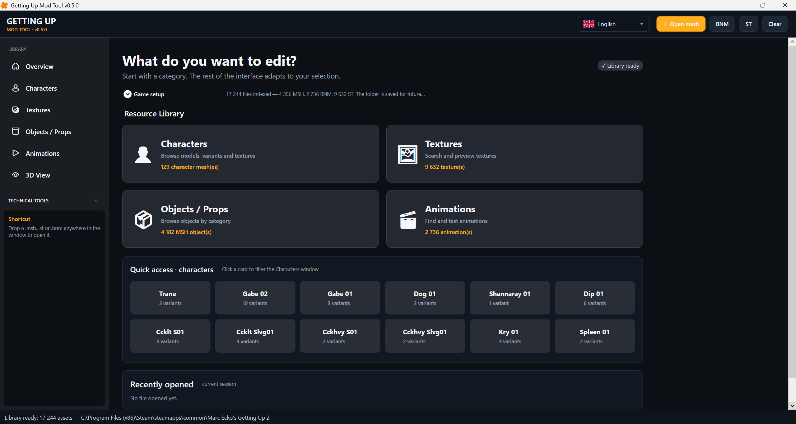
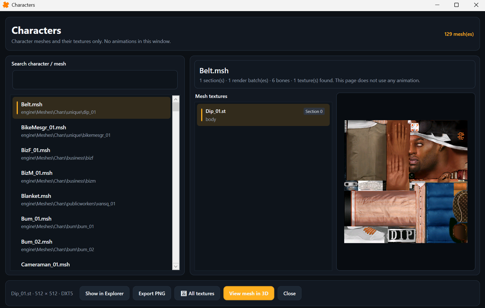
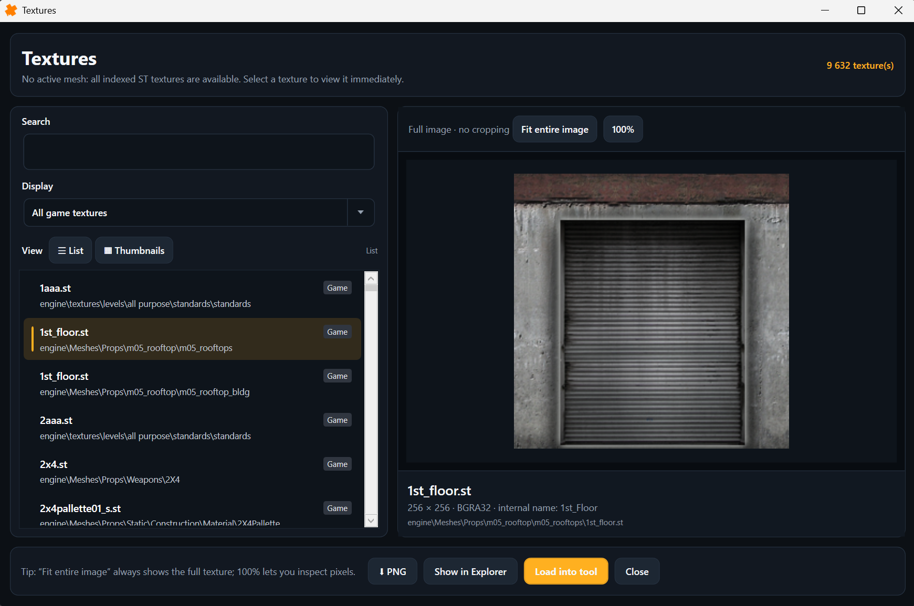
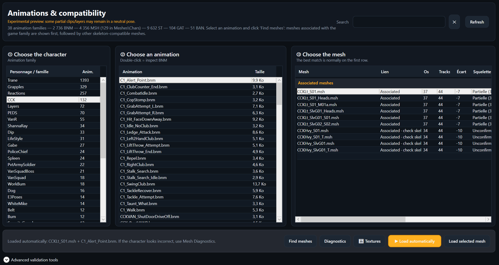
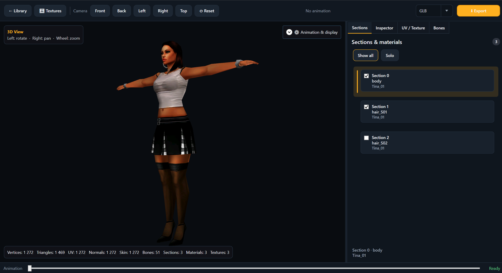
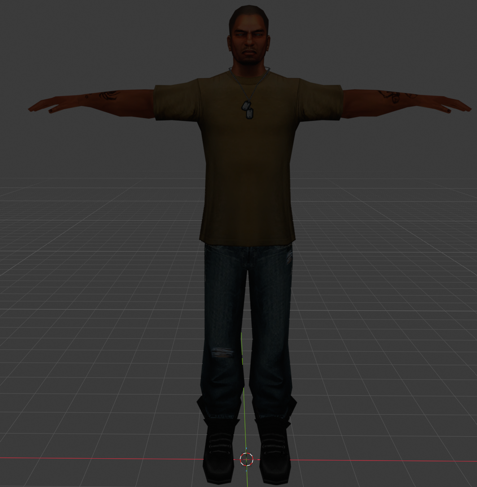
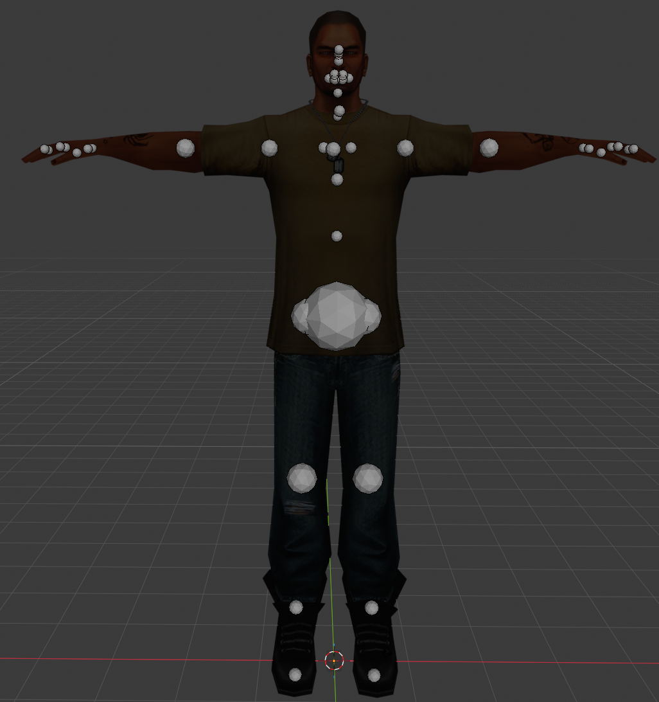

<div align="center">


# Getting Up Mod Tool

**Browse, preview and export the assets of _Marc Ecko's Getting Up: Contents Under Pressure_ (PC).**


</div>

> [!NOTE]
> Unofficial community project, not affiliated with or endorsed by the game's publisher, developer or rights holders.
> **No game files are included** — you need your own copy of the game.

## Features

- **Resource library** — detects the game install (Steam or manual folder), indexes ~17,000 files and lets you search them by name, type or folder.
- **Character browser** — every character mesh with its variants and textures.
- **Object browser** — props sorted into categories (weapons, graffiti tools, vehicles, furniture…).
- **Texture browser** — preview any `.st` texture, fit-to-window or 1:1, and export it to PNG.
- **3D viewer** — orbit camera and presets, per-section visibility, material inspector, UV layout, and a skeleton/bone inspector.
- **Animation preview** *(experimental)* — pick a BNM animation, and the tool finds the meshes whose skeleton matches it.
- **Export** — OBJ + MTL + PNG, glTF 2.0 and binary GLB with embedded textures. Ready for Blender.
- **Four languages** — English, French, Russian and Spanish, switchable at any time.
- **Drag & drop** — drop a `.msh`, `.st` or `.bnm` anywhere in the window to open it.

## Screenshots

| Overview | Characters |
|:---:|:---:|
|  |  |
| **Objects** | **Textures** |
|  |  |
| **Animations** | **3D viewer** |
|  |  |

### In Blender

Models exported as glTF / GLB open directly in Blender (**File → Import → glTF 2.0**), with their textures and their skeleton.

| Imported model | Imported skeleton |
|:---:|:---:|
|  |  |


## Getting started

1. Download the latest build from the [**Releases**](../../releases) page:
   - `win-x64` — small download, needs the [.NET 8 Desktop Runtime](https://dotnet.microsoft.com/download/dotnet/8.0).
   - `win-x64-self-contained` — larger, runs without installing anything.
2. Unzip it anywhere and run `GettingUpModTool.exe`.
3. The game folder is detected automatically. If it isn't, open **Overview → Game setup** and choose it with **Browse…**.
4. Pick a category (Characters, Textures, Objects or Animations) and open an asset in 3D.
5. Export it from the 3D view: choose OBJ, glTF or GLB, then click **Export**.

## Supported formats

| Extension | Content | Support |
|---|---|---|
| `.msh` | Meshes (characters, props, scenery) | Read · 3D preview · export |
| `.st` | Textures (DXT1/DXT5…) | Read · preview · PNG export |
| `.bnm` | Skeletal animations | Read · experimental preview |
| `.mtm` | Materials | Read · inspection |
| `.gat` | Attachment points | Read · inspection |
| `.ban` | Animation sections | Read · inspection |
| `.gin` `.cin` `.plr` `.cap` `.smf` `.fts` | Other game data | Indexed · hex view |

Exports always use the mesh in its default (bind) pose. The animation shown in the viewer is not exported.

## Building from source

Requirements: Windows 10/11 and the [.NET 8 SDK](https://dotnet.microsoft.com/download/dotnet/8.0). Visual Studio 2022 is optional.

```bat
git clone https://github.com/<your-account>/GettingUpModTool.git
cd GettingUpModTool
dotnet build GettingUpModTool.sln -c Release
dotnet run --project src\GettingUpModTool\GettingUpModTool.csproj
```

`build.bat` and `run.bat` do the same thing with a double-click.

To produce a portable single-folder build:

```bat
dotnet publish src\GettingUpModTool\GettingUpModTool.csproj -c Release -r win-x64 --self-contained true -o dist\GettingUpModTool-win-x64-self-contained
```

<details>
<summary><b>Project layout</b></summary>

```text
src/GettingUpModTool/
├── Core/
│   ├── Formats/     MSH, ST, BNM, MTM, GAT, BAN readers
│   ├── Animation/   skeleton binding and BNM playback
│   ├── Game/        install detection, asset index, compatibility database
│   ├── IO/          OBJ / glTF / GLB / PNG exporters, hex dump
│   └── Models/      mesh, skeleton and material data
├── Themes/          dark theme (colors, controls, scrollbars, tooltips)
├── MainWindow.*.cs  main window, split by feature (Library, Viewer, Export…)
├── *BrowserWindow   Characters, Objects and Textures windows
└── Localization*.cs UI translations (EN, FR, RU, ES)
```

The French text in the XAML is the translation key. Translations live in `LocalizationService.cs` and `LocalizationCatalog.cs`. Sentences that contain values (counts, file names) are templates in `LocalizationTemplates.cs`, used through `LocalizationService.F("… {0} …", value)`.

</details>

## Settings and logs

Everything is stored in `%LOCALAPPDATA%\GettingUpModTool`:

| File | Content |
|---|---|
| `settings.json` | Game folder, language and options |
| `crash.log` | Unexpected errors |
| `export.log` | Texture warnings produced during exports |
| `settings-errors.log` | Settings read/write failures |

Attach `crash.log` when you report a bug.

## Known limitations

- Animation preview is **experimental**. The game's layered animation system (partial-body `L_TR_*` clips blended over a base) is not fully reproduced, so some partial clips leave part of the body in the bind pose.
- Facial `MeshAnim_*` clips are detected but not played.
- A few unusual BNM variants are still unsupported.
- The tool reads the game files but never modifies them.

More details in [`Docs/KNOWN_LIMITATIONS.md`](Docs/KNOWN_LIMITATIONS.md). The full history is in the [changelog](Docs/CHANGELOG.md).

## Contributing

Bug reports and pull requests are welcome. Please include:

- what you did, what you expected and what happened;
- the file involved (its path inside the game folder, not the file itself);
- `crash.log` if the app crashed.

To add or fix a translation, edit the entry in `LocalizationService.cs` / `LocalizationCatalog.cs` (or `LocalizationTemplates.cs` for sentences with values) and check the four languages in the app.

## License

No license has been chosen yet, so the code is **all rights reserved** by **Yhzan95** for now. Please ask before reusing it.

---

<details>
<summary><b>🇫🇷 En français</b></summary>

**Getting Up Mod Tool** est un outil communautaire non officiel pour explorer les fichiers de *Marc Ecko's Getting Up* (PC) : personnages, objets, textures et animations. Il affiche les modèles en 3D et les exporte en OBJ, glTF ou GLB pour Blender. Aucun fichier du jeu n'est fourni : il faut avoir le jeu.

1. Télécharge la dernière version dans [**Releases**](../../releases), puis lance `GettingUpModTool.exe`.
2. Le dossier du jeu est détecté automatiquement. Sinon : **Vue d'ensemble → Configuration du jeu → Parcourir…**.
3. Choisis une catégorie, ouvre un élément en 3D, puis exporte-le depuis la Vue 3D.

L'interface est disponible en français, anglais, russe et espagnol. L'aperçu des animations reste expérimental, et les exports utilisent toujours la pose de base du modèle.

</details>
